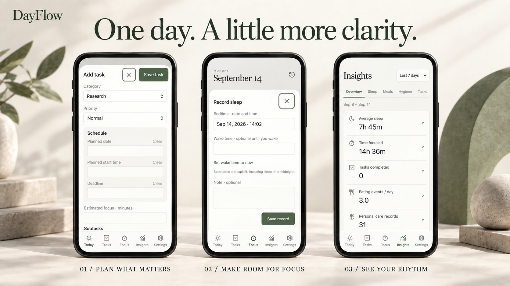

  

<h1 align="center">让每一天，自有节奏。</h1>

  为任务、专注和日常生活，留一处清爽的空间。 
  打开网页，就能开始。

  <a href="https://jiangyt1412.github.io/dayflow/"><strong>打开 DayFlow ↗</strong></a>
  &nbsp; · &nbsp;
  <a href="#从今天开始">开始使用</a>
  &nbsp; · &nbsp;
  <a href="README.md">English</a>

无需注册 · 数据保存在本地 · 首次缓存后可离线使用

<strong>版本 1.3.1</strong> · <a href="CHANGELOG.zh-CN.md">更新记录</a> · <a href="QA.md">验证报告</a>

---

## 把一天，放在一起

DayFlow 将任务计划与日常记录放进奶油白、鼠尾草绿的简洁界面。安排重要的事，为眼前的任务留出专注时间，也能回顾生活中的点滴。

基于应用界面制作的宣传示意图 · 演示数据

| 安排重要的事                                                                                                                | 留出专注时间                                                                     |
| --------------------------------------------------------------------------------------------------------------------------- | -------------------------------------------------------------------------------- |
| 用 **Open（未完成）** 和 **Completed（已完成）** 管理任务，按重要程度排序，添加子任务，以及可选的日期、开始时间和截止时间。 | 使用正向计时器开始、暂停和保存专注。可以关联具体任务，也可以只记录在一个分类下。 |
| **照顾日常生活**                                                                                                            | **看见自己的节奏**                                                               |
| 记录睡眠、饮食与个人护理，需要时可以编辑。                                                                                  | 在 **Insights** 选择日期范围，通过汇总与图表回顾自己记录的生活和时间分配。       |

删除任务后，与它关联的已保存专注记录仍会保留。

**1.3.1 更新：** 点击分类，平滑进入该分类的任务饼图，用引导线直接查看各任务用时与占比；点击 **All categories** 返回。达到一小时的专注用时改为小时加分钟，Tasks 第一项上方多余的灰线也已移除。[查看更新详情](CHANGELOG.zh-CN.md)。

**1.3.0 更新：** 底部导航滑动选中效果、明确的保存／计时反馈和轻量弹窗动画。点击分类饼图可查看各任务用时；任务左划仅露出 Delete，点击才删除，最近一次任务操作可在 10 秒内撤销。

**1.2.1 更新：** Focus 分类饼图可选择近 7／30／90 天、全部或自定义日期；睡眠和饮食时间轴从上到下按时间先后显示，增加坐标留白并移除点击蓝框。

**1.2.0 新增：** 在 **Insights → Notes** 写日记、记录心情和状态；第二项 **Focus** 提供四项累计、分类饼图、24 小时分布和逐日/全年逐月趋势。专注历史显示关联任务名称，删除任务仍保留记录；更新前已经删除且没有名称快照的任务无法恢复名称。

## 从今天开始

1. **打开 [DayFlow 网站](https://jiangyt1412.github.io/dayflow/)。** 无需注册，也不必安装软件。
2. **添加第一个任务。** 先在 **Settings** 创建分类，再进入 **Tasks → Add task**，填写内容后点击 **Save task**。在 **Focus** 选择分类即可开始计时；如果要关联任务，请为任务选择相同分类。
3. **放到 iPhone 主屏幕。** 用 Safari 打开网站，选择 **分享 → 添加到主屏幕**；如果出现 **作为网页 App 打开（Open as Web App）**，将其开启。操作可参考 [Apple 官方指南](https://support.apple.com/en-nz/guide/iphone/iphea86e5236/ios)。

首次使用时保持联网，在 **Settings** 看到 **Ready to work offline** 后，即可离线继续记录。当前应用界面为英文，这份文档提供中文说明。

## 记录留在你的设备上

DayFlow 将数据保存在当前浏览器或已安装网页应用的本地存储中，**没有账号系统，也不会自动云同步**。其他设备、浏览器或主屏幕安装实例中的记录可能彼此独立。

- **Export backup：** 导出完整的 JSON 备份。建议定期保存一份，在更换使用入口前也先备份。
- **Import backup：** 导入并校验 JSON 文件，在确认后**替换当前本地数据**，不会合并两边的记录。
- **Export CSV：** 导出选定类型的记录，方便在表格软件中查看；它不能代替完整备份。

备份文件可直接读取，未加密，请妥善保管。清除网站数据可能导致本地记录丢失。

<strong>关于这个仓库</strong>

本仓库通过 GitHub Pages 托管 DayFlow 已发布的网站构建文件和项目介绍，不包含可直接编辑开发的完整应用源码工程。

应用使用 **React、TypeScript 和 Vite** 构建，通过 **Dexie / IndexedDB** 保存本地数据，使用 **Recharts** 展示图表。

宣传视觉由 AI 辅助制作。界面示意图参考了应用并使用虚构演示数据，细节可能与实际页面略有不同。

---

<strong>找到属于自己的日常节奏。</strong> <a href="https://jiangyt1412.github.io/dayflow/">从今天开始 ↗</a>

